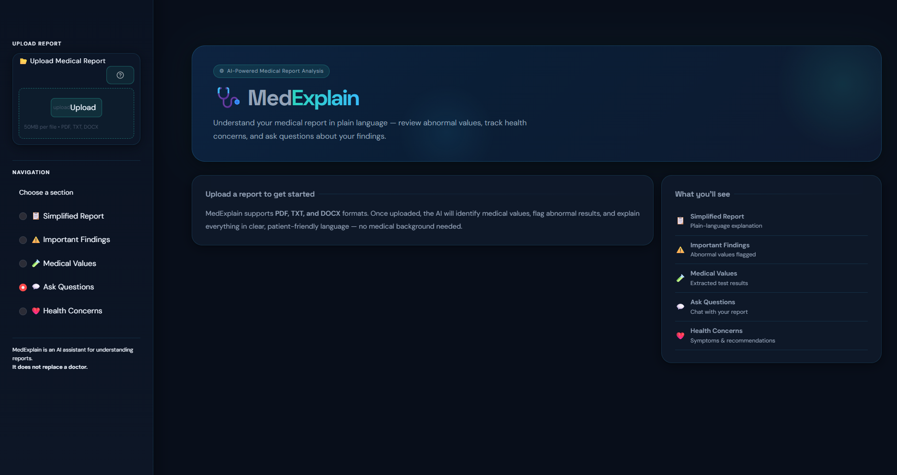
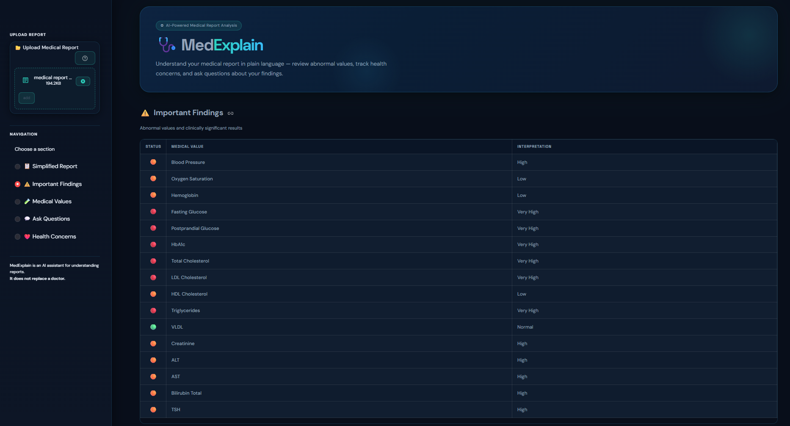
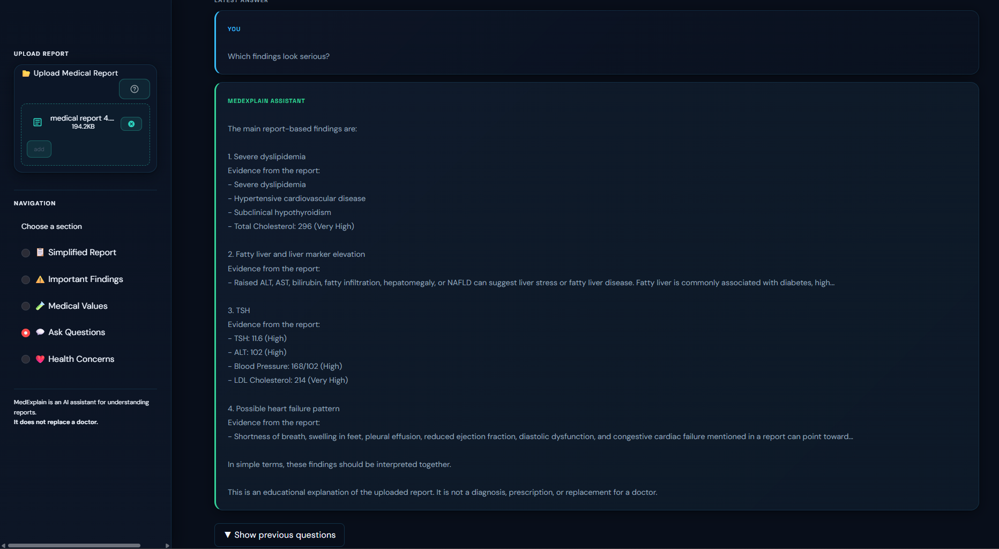
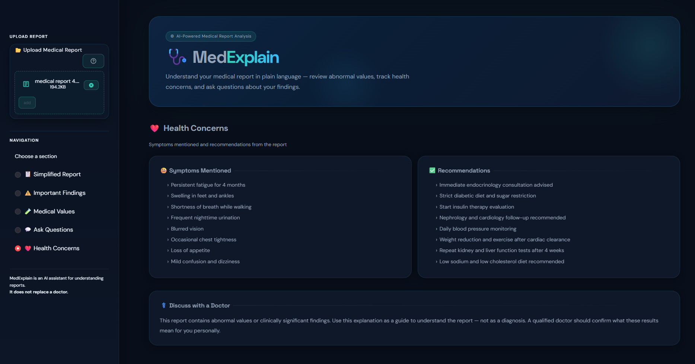

# 🩺 MedExplain

MedExplain is a medical report simplification system that helps patients understand their medical reports in plain language.

Medical reports often contain technical terms, laboratory values, and clinical findings that can be difficult for non-medical users to understand. The aim of this project is to extract important information from a report and present it in a simpler and more understandable way.

Users can upload a medical report, review important findings, explore possible health concerns, retrieve relevant medical knowledge, and ask questions about the report through a conversational assistant.

This project was developed as part of my interest in Artificial Intelligence, Natural Language Processing, and healthcare applications.

## 🚀 Live Demo

https://medexplain-healthcare-ai.streamlit.app/

## Features

### 📋 Medical Report Analysis

* Extracts medical values from reports
* Identifies important findings
* Detects abnormal values
* Generates patient-friendly explanations

### 🧠 Semantic Medical NLP

* Uses semantic analysis instead of relying only on keywords
* Detects symptoms and clinical findings from report text
* Identifies possible health concerns

### 🔎 Medical Knowledge Retrieval

* Retrieves relevant medical information using FAISS
* Connects report findings with supporting medical knowledge
* Generates contextual explanations

### 💬 Conversational Assistant

* Ask questions about uploaded reports
* Receive report-specific answers
* Supports follow-up questions
* Uses report context to provide more relevant responses

### 📄 PDF Summary Export

Generate a downloadable report containing:

* Medical values
* Important findings
* Health concerns
* Simplified explanations
* Recommendations

### 📂 Multi-Format Support

Supported formats:

* PDF
* DOCX
* TXT

### 🔍 OCR Support

Scanned medical reports can be processed using OCR.

OCR works best with clear printed reports and may be less reliable for handwritten notes, ECG images, or image-heavy medical documents.

## Screenshots

### Homepage



### Important Findings



### Conversational Assistant



### Health Concerns



## Technology Stack

### Frontend

* Streamlit

### Backend

* Python

### AI & NLP

* Sentence Transformers
* FAISS
* spaCy
* Semantic NLP techniques

### Document Processing

* pdfplumber
* pdf2image
* pytesseract
* python-docx

## How It Works

Medical Report

↓

Text Extraction

↓

Medical Value Extraction

↓

Severity Analysis

↓

Semantic Medical Processing

↓

Medical Knowledge Retrieval

↓

Patient-Friendly Explanation

↓

Conversational Question Answering

↓

PDF Summary Generation

## Why I Built This

While working with medical reports, I noticed that many people struggle to understand what their reports actually mean.

Most reports are written for healthcare professionals and contain terminology that can be confusing for patients. I wanted to build a system that could make medical information easier to understand while still preserving the important context behind the findings.

This project also allowed me to explore practical applications of Natural Language Processing, semantic search, retrieval systems, and conversational AI in the healthcare domain.

## Installation

Clone the repository:

```bash
git clone https://github.com/rpraneeth63/MedExplain-Healthcare-AI.git
cd MedExplain-Healthcare-AI
```

Install dependencies:

```bash
pip install -r requirements.txt
```

Run the application:

```bash
streamlit run app.py
```

## Model Setup

Language model files are not included in this repository.

Download a compatible GGUF model and place it inside:

```text
models/
```

Example:

```text
models/tinyllama-1.1b-chat-v1.0.Q4_K_M.gguf
```

## Current Version

**MedExplain v1.5**

Implemented modules:

* Medical report understanding
* Semantic medical NLP
* FAISS-based retrieval
* Conversational assistant
* PDF export
* Multi-format document support
* OCR support for scanned reports

## Future Improvements

Some possible future enhancements include:

* ECG interpretation
* Retinal scan analysis
* Prescription understanding
* Multimodal healthcare AI
* Specialist recommendation systems

## Disclaimer

This project was developed for educational and research purposes.

The information generated by MedExplain should not be considered medical advice, diagnosis, or treatment. Users should always consult a qualified healthcare professional regarding medical concerns.
